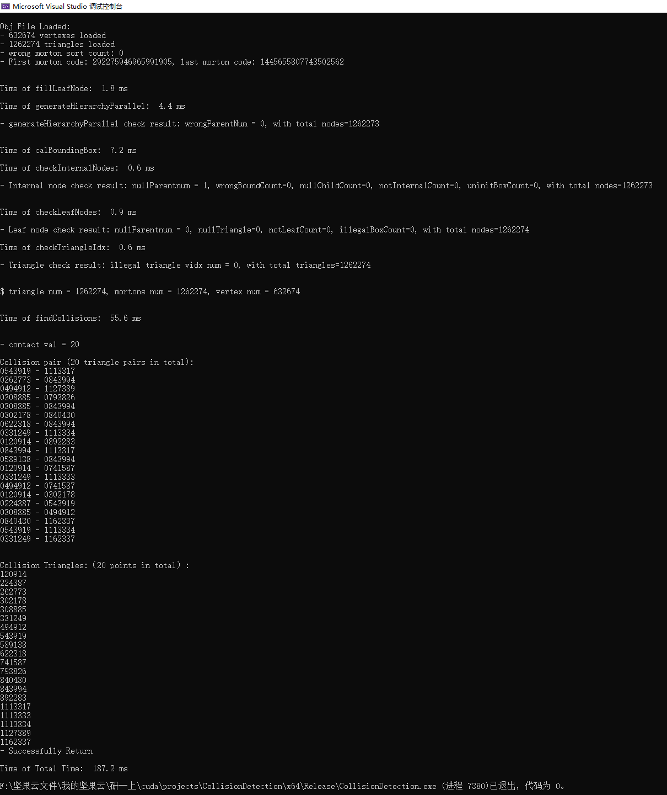

# Collision Detection

This code uses **binary tree based Bounding Volume Hierarchy(BVH)** to accelerate detection of collided triangle pairs in an OBJ file. 

It mainly references to a Nvidia blog: [Thinking Parallel, Part III: Tree Construction on the GPU](https://developer.nvidia.com/blog/thinking-parallel-part-iii-tree-construction-gpu/).

Also, this code uses an error handling utility of CUDA provided by Nvidia "Cuda-by-Examples" tutorial: [Cuda-by-Examples](https://developer.nvidia.com/cuda-example), which is included under `common` folder.

## Method Overview
- **Overall Structure**: Binary-Tree Based BVh
- **Bounding Box Type**: AABB Bounding Box
- **Triangle Coding**: Center of gravity of a triangle + 64 bit Morton code

## About Data
An OBJ file is zipped in `resources/flag-2000-changed.zip`, which is a waving flag containing **1200K** triangles. 
Also, it contains 20 collided triangle pairs to be found out.

## My Device
I use RTX 2060 6GB on laptop as the running device, and it contains **1920 CUDA cores**.

## Result
About totally **80 ms** of the collision detection process, where actually triangle-wise collision detection process takes **56 ms**. 

I also tried to detect collision by directly compare triangles one-by-one, and it takes much longer time, about **3322830 ms**. This indicates BVH accelerates detection by 43000 times.

